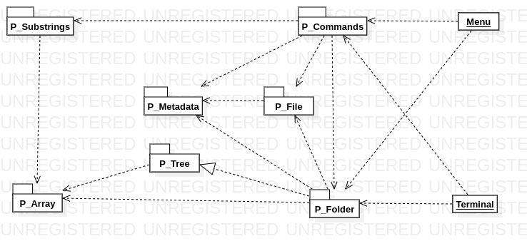

BÉDEX Antoine

BAICHOO Esteban

# Rapport de Projet de Méthodologie de la Programmation

## Objectif du rapport

Ce rapport a pour but de vous présenter le projet réalisé dans le cadre du cours de "Méthodologie de la Programmation" à l'ENSEEIHT, Toulouse.

Bien que ce projet soit unique, les professeurs nous ont autorisé à travailler en équipe, à condition que chaque membre de l'équipe participe au développement. Ce projet a donc été réalisé par Antoine BÉDEX et Esteban BAICHOO.

Ce rapport abordera toutes les parties de la réalisation du projet, allant de la présentation des choix réalisés à la présentation (succincte) des algorithmes et types de données utilisés, en passant par la démarche adoptée et les difficultés rencontrées.

## Introduction

Le projet proposé consiste à développer un Système de Gestion de Fichiers (SGF) similaire à ceux retrouvables sur des systèmes d'exploitations tels que UNIX. Un SGF permet l'organisation des répertoires et fichiers utilisateurs de manière hiérarchique. Un SGF gère également la manipulation des fichiers et des répertoires, ainsi que la gestion de l'espace mémoire occupé par ces derniers. Chaque répertoire et fichier est muni de données (tailles, poids, chemin d'accès, parent) appelées "métadonnées".

Dans le cadre du projet, il a été demandé de programmer un SGF ainsi que les commandes qui lui sont associées. Pour cela, deux "mini-interpréteurs de commande" ont été réalisés, l'un offrant un menu semi-graphique tandis que l'autre offre une interface proche des terminaux classiques.

Le langage de support proposé est le langage Ada, utilisé lors des enseignements de ce cours.

## Plan

Le rapport proposé suivra ce plan :

[TOC]

Pour chaque partie de ce rapport, les modules seront traités un à un.

## Architecture de l'application

Afin de permettre une modularité importante, il a été décidé de décomposer un maximum le projet en plusieurs modules Ada. Dans cette partie, les différents modules développés seront présentés de façon succincte. Il ne sera pas fait état de l'utilisation des bibliothèque classiques d'Ada, telles que `Ada.Text_IO`, puisque l'utilisation de celles-ci est obligatoire. Voici les paquetages développés :

- `P_Constants` : Paquetage contenant toutes les constantes utilisées par les paquetages du programme. Ce paquetage permet de s'assurer que la modification d'une constante (telle que la taille max d'une `String`, par exemple) se répercutera sur l'ensemble du programme.
-  `P_Array` : Paquetage contenant la définition d'une structure de données de type tableau appelée `T_Array`, ainsi que les opérations applicables sur un tableau telles que l'ajout et la suppression d'une valeur, la consultation du nombre de valeurs, etc...

- `P_Tree` : Paquetage contenant une structure de données de type arbre, tel que stipulé dans le sujet. `P_Tree` contient également un ensemble de sous-programmes applicables sur un arbre, tels que l'ajout d'un enfant, la possibilité d'obtenir un parent, de savoir si un arbre est vide, etc...

- `P_Metadata` : Paquetage contenant une structure de données de type enregistrement `T_Metadata` ainsi que les opérations s'appliquant dessus. Ce paquetage vise à représenter "l'information sur l'information" des dossiers et des fichiers. Les métadonnées contiennent toutes un nom, une taille, des droits et un chemin d'accès. Les opérations du paquetage permettent de créer (`create`) puis de modifier (`set`) et de consulter (`get`) un type `T_Metadata`.
- `P_File` : Paquetage permettant de représenter un fichier. Il contient un type `T_File` qui sera détaillé ultérieurement, ainsi que les opérations applicables sur un fichier telles que sa création et sa modification.

- `P_Folder` : Ce paquetage contient un paquetage `P_Folder_Tree` qui est une instanciation du paquetage générique `P_Tree`, ainsi que les opérations applicables sur un `P_Folder_Tree.T_Tree`, c'est à dire, un type dossier. `P_Folder` permet la modification d'un dossier, via l'ajout de fichiers ou de sous-dossiers par exemple.
- `P_Substrings` : Paquetage contenant des opérations applicables sur des `String` telles que le découpage selon un `Character` spécifique. Ce paquetage a été développé dans le but de "parser" plus facilement les lignes de commande saisies par l'utilisateur. Il contient un type `T_Substrings` qui sera détaillé ultérieurement.
- `P_Commands` : Paquetage le plus volumineux du projet, il contient l'ensemble des commandes définies dans le sujet telles que `ls`, `cp`, `mv`, etc... ainsi que des sous-programmes résultants de la factorisation de ces commandes.

Deux programmes principaux ont également été développés :

- `menu` : Il s'agit d'un menu semi-graphique permettant à l'utilisateur d'effectuer une commande parmi une liste de choix proposés.
- `terminal` : Il s'agit d'un interpréteur de commande classique tel qu'on peut le retrouve sur les systèmes d'exploitation de type Unix.

Le dossier `tests` contient un ensemble de programmes de tests (appelés `test_*.adb`) permettant de tester les paquetages précédents. 

Voici un diagramme permettant de représenter l'architecture de l'application. Afin de soulager la lecture, il a été décidé de faire fi du paquetage `P_Constants` (qui est utilisé par presque tous les autres paquetages) ainsi que des bibliothèques Ada telles que `Ada.Text_IO` ou `Ada.Strings.Unbounded`.



Sur ce diagramme, la flèche blanche ("d'héritage") représentent l'instanciation d'un paquetage : le paquetage dossier est une instanciation du paquetage arbre. Les flèches noires représentent le fait qu'un paquetage dépende un autre, par exemple, le paquetage dossier dépend du paquetage fichier.

Durant l’entièreté du projet, l'objectif a été de faire en sorte que chaque paquetage dépende d'un nombre minimal de paquetage, afin de favoriser la modularité.

## Choix réalisés

Il est à noter que nous avons décidé de coder intégralement en anglais. Nous pensons que c'est une bonne pratique et qu'il est important de s'y habituer. Cependant, nous n'avons pas eu le temps de traduire nos raffinages, nous les avons donc laissé en français.

À plusieurs occasions dans le projet, nous avons utilisé la commande `subtype` afin de renommer des types de données avec un alias plus court. Nous avons trouvé cette pratique dans la documentation fournie sur le site https://docs.adacore.com.

Le type `Unbounded_String` de la bibliothèque `Ada.Strings.Unbounded` a été utilisé, préférablement au type `String`. Le type `Unbounded_String` permet de définir et d'utiliser des chaînes de taille variable.

Un nombre important de choix plus ou moins arbitraires a été fait. Pour chaque paquetage, il convient de détailler ceux-ci :

- `P_Constants` :
  - Une taille maximum de `100` a été définie pour les tableaux. Comme on le verra plus tard, les dossiers et les fichiers sont contenus dans des tableaux. Ces derniers ne pourront donc pas excéder `100` fichiers et `100` dossiers.
  - La taille maximum d'une `String` a été définie à `100` caractères, pour tout notre projet. Cela permet d'endiguer tout potentiel problème de débordement. Étant donné qu'Ada est un langage robuste, il ne permettra pas qu'une chaîne saisie par un utilisateur dépasse cette taille de `100` (sinon quoi il la coupera). Il a par ailleurs été décidé de vérifier, dans tout le projet, que la taille des `String` fournies en paramètre des sous-programmes ne dépasse jamais cette taille de `100` (via des pré-conditions).
  - La taille maximum d'un fichier a été définie à `1Go`, c'est à dire à `1000*1000*1000` octets. Comme nos tailles sont exprimées en octets, une limite plus haute aurait dépassé la valeur maximum d'un `Integer` en Ada, nous forçant à utiliser des `Long`, ce que nous ne voulions pas.
  - La taille d'un dossier est de `10Ko`, cela été stipulé dans le sujet.
  - Une constante `FILE_SEPARATOR` a été définie, elle est égale à un `/`. La raison derrière ce choix est que si nous décidons de changer le caractère séparateur de notre SGF, nous n'aurons qu'à changer une fois cette constante, et tout le reste du programme s'adaptera.
- `P_Array` :
  - Une structure de données de type tableau a été choisie. Cela peut paraître désavantageux, notamment de part le fait qu'un tableau possède une taille fixe et que la mémoire (aussi bien au sens de la RAM que de la mémoire dans la partie 2 du sujet) est limitée. Cependant, plusieurs raisons nous ont poussées vers ce choix :
    - Pour accéder à une valeur donnée d'une liste, il faut pouvoir comparer les éléments de cette liste. Or, dans le cas d'un arbre N-aire, nos éléments sont des arbres (c'est à dire des fils d'un nœud). Cependant, le paquetage `P_Tree` est générique. Il n'est pas possible de comparer des éléments génériques sans avoir à spécifier une fonction de comparaison lors de l'instanciation du paquetage. Dans notre cas, cette dite fonction devrait pouvoir prendre deux dossiers en entrée, puis renvoyer vrai si ils sont identiques ou faux sinon. Cependant, nous ne pouvions pas développer de méthode utilisant le type dossier (`P_Folder_Tree.T_Tree`) avant d'avoir défini ce même type, type qui n'est défini qu'une fois l'instanciation du paquetage `P_Tree` effectuée. Nous étions donc sur un Ouroboros. Si nous avions utilisé les fonctionnalités objet d'Ada, ce problème ne se serait pas présenté. Il était cependant spécifié dans les consignes de ne pas le faire. Ce problème sera détaillé dans les difficultés rencontrées.
    - Dans Linux, la structure de données utilisée pour représenter les fils d'un dossier est une version très modifiée d'un tableau. En effet, Linux possède un algorithme qui crée des tableaux d'une taille `2^n`, et peut en recréer dynamiquement en fonction de la quantité de données mises dans un dossier. Cependant, en creusant plus, il serait en fait plus exact de parler de chaînes de tableaux, c'est pourquoi nous pensons que notre solution n'est pas optimale. Elle était surtout beaucoup plus pratique pour nous.
  - Nous avons décidé de suivre une programmation offensive, c'est à dire d'utiliser des Pré et Post conditions dans les cas de dépassement de la taille d'un tableau ou de tentative d'accès à une case inexistante du tableau. Étant donné que c'est nous qui gérons ce type de problème plus loin dans le code, et que cela ne dépend pas d'une interaction utilisateur, le fait de définir des exceptions aurait été de trop.
  - Afin de respecter le principe d'encapsulation, le type `T_Array` a été défini en privé.
  - Il était important pour nous que ce paquetage soit générique car nous l'utilisons plusieurs fois dans le programme (tableau de dossiers, tableau de fichiers, tableau de chaînes, etc...).
- `P_Tree` : 
  - Étant donné que ce paquetage sera par la suite instancié en tant que dossier, il n'était pas envisageable d'utiliser un arbre binaire (tel qu'étudié lors des cours de "Méthodologie de la Programmation"). Il était donc naturel d'imaginer un arbre N-aire.
  - Afin de respecter au mieux l'encapsulation, le type `T_Node`, qui représente un nœud de l'arbre, a été défini en privé. Cette nuance est importante puisqu'elle a, par la suite, guidé une partie des choix.
  - Nous avons décidé que les fils d'un nœud seraient représentés sous forme de tableau.
- `P_Metadata` :
  - Afin de respecter l'encapsulation, le type `T_Metadata` a été défini en privé. Cependant, les types `E_Rights` et `T_Rights` permettant le représentation des droits utilisateurs ont été définis en public. Nous souhaitions qu'un utilisateur puisse créer lui même un droit, et le passer en paramètre à des fichiers et dossiers.
- `P_File` :
  - Afin de simplifier notre algorithmie, il a été décidé qu'un fichier (`T_File`) soit un pointeur. Grâce à cela, un fichier peut prendre la valeur nulle. Un fichier est donc un pointeur sur une structure de données de type enregistrement (`T_R_File`).
  - Une fois crée, il n'est pas possible de modifier directement le chemin d'accès d'un fichier. Cela laisserait une porte ouverte à de nombreuses incohérences. Une fonction `clone` a donc été développée, elle renvoie le clone d'un fichier, moyennant une modification de son chemin d'accès (et, potentiellement, de son nom). Il s'agit d'une modification du patron de conception "Prototype".
  - Afin de respecter au mieux l'encapsulation, `T_R_File` a été défini en privé.
- `P_Folder` :
  - Étant donné que le type dossier vient en fait du paquetage `P_Folder_Tree` qui est une instanciation de `P_Tree`, le moyen pour y accéder était `P_Folder_Tree.P_Tree`, nous l'avons renommé en `P_Folder` à l'aide de `subtype`.
  - Un dossier contient des dossiers et des fichiers. `T_Folder` étant un `T_Tree` instancié, les dossiers sont donc les enfants dans l'arbre. Cependant, il a fallu trouver un moyen d'ajouter des fichiers enfants d'un dossier à un dossier, et ce, sans modifier `P_Tree`. Pour cela, nous avons utilisé une instanciation du paquetage `T_Array` que nous avons appelé `T_Files`. Chaque dossier aura un `T_Files` dans ses données. Le dossier a donc deux sources de données : les sous-dossiers qui viennent des enfants dans l'arbre, et les fichiers qui viennent d'un tableau de fichiers dans ses données.
  - Étant donné qu'un dossier `root` est unique pour toute la durée de vie d'un programme, un patron "Singleton" a été utilisé. `root` est en fait crée par une fonction privée `create_root`, le reste du programme fera appel à `root` via la fonction `get_root`, qui créera `root` s'il n'existe pas déjà, puis le renverra.
  - Il n'est pas possible de modifier directement ni le chemin d'accès, ni le parent d'un dossier. Pour "déplacer" un dossier, il faudra en créer un nouveau et copier les données du précédent vers le nouveau, à la manière du clonage dans `P_Files`. 
  - Le type `T_Folder_Data`, qui contient les métadonnées (`T_Metadata`) et le tableau de fichiers (`T_Files`) d'un dossier doit être en public, sans quoi nous ne pouvons pas instancier `P_Tree` avec.
- `P_Substrings` :
  - Afin de manipuler des chaînes de taille variable, il a fallu utiliser le paquetage `Ada.Strings.Unbounded` d'Ada.
  - Le type `T_Substrings` est public car c'est une instanciation de `P_Array.T_Array` contenant des `Unbounded_String` et que nous souhaitons que le reste du programme sache que c'est un tableau. De plus, le fait d'utiliser la commande `subtype` pour renommer `P_Substrings_Array.T_Array` en `T_Substrings` nous force à mettre `T_Substrings` en public car Ada ne nous permet pas de déclarer des `subtype` privés.
- `P_Commands` :
  - Afin d'afficher les fichiers et dossiers de manière triée par ordre alphabétique, il nous a fallu définir un type `T_R_Sibling` et un type `T_Siblings_Set` dont nous détaillerons l'utilisation dans la prochaine partie. Nous avons ici jugé intéressant d'utiliser le paquetage `Ada.Containers.Ordered_Sets` et de vous montrer une manière peu commune mais élégante de trier les dossiers et les fichiers.
  - Dans ce paquetage, la seule procédure publique est `run_command`. Cette procédure permet, via un dossier courant et une ligne de commande, d'exécuter la commande associée ou de renvoyer une erreur. Nous nous sommes rendu compte que seule cette procédure était appelée depuis l'extérieur du paquetage. Nous avons donc décidé de mettre les commandes telles que `ls` et `cd` en privé. Ce choix n'est pas anodin : nous souhaitons cacher au maximum l'implémentation des commandes, afin de créer une sorte de "boîte noire" tel que cela est fait dans la réalité. Cela a rendu extrêmement difficile l'écriture de tests pour les commandes. Puisque Ada ne permet pas de tester des sous-programmes privés, nous pouvions uniquement tester `run_command` en changeant la ligne de commande à exécuter. Nous nous reposons donc sur le fait que `run_command` fonctionne correctement afin de tester nos commandes (ce qui n'est pas dangereux étant donné son algorithmie très simple). Nous avons tout de même réussi à écrire des tests poussés pour tester chaque commande individuellement. Cela est une pure limite de la technologie utilisée et nous n'aurions pas fait comme ça dans un autre langage.

Pour les programmes principaux :

- `menu` :
  - Afin d'alléger le code (qui était déjà volumineux avec les affichages !), nous avons décidé de faire appel à `run_command` depuis le `menu`. Le menu récupère donc les choix de l’utilisateur (commande à exécuter, chemin d'accès du fichier à créer, etc...), construit une `String` avec ces choix, puis l'exécute via `run_command`. L'utilisation du parser depuis un menu peut paraître bizarre, cependant, ce procédé est souvent utilisé dans le développement d'applications graphiques qui se basent sur des utilitaires en ligne de commande (tel que `Gparted` avec `Parted`). On parle alors de patron "Modèle / Vue / Contrôleur". Ici, le modèle serait notre paquetage `P_Commands` et son interface d'accès la procédure `run_command`.
- `terminal` :
  - Le code du terminal est très succinct, nous avons décidé d'ajouter de la couleur à nos affichages (via les caractères d'échappement ASCII) pour rendre cela plus attrayant.

**<span style='color:#b03434'>Enfin, il est primordial de noter que nous avions pour objectif de rendre notre programme robuste. Nous avons ainsi envisagé TOUS LES CAS possibles qui pourraient mettre en défaut un programme développé rapidement. Par exemple, la suppression d'un dossier alors que l'on est dans ce dernier, ou la copie d'un dossier dans un de ses sous-dossiers. Cela a rendu plus pénible notre travail et notre code, mais nous ne pouvions pas consciemment laisser passer des erreurs de la sorte. Notre code est certainement plus lourd que d'autres, car nous gérons beaucoup plus de cas d'erreurs et qu'il est quasiment impossible de factoriser cela. Nous espérons que cet effort sera prit en compte.</span>**

## Types de données et algorithmes

### Types de données

- `P_Array` :
  - Le type `T_Values` est un tableau d'éléments génériques `T` de taille `NMAX_VALUES` (constante du paquetage `P_Constants`). Il représente les valeurs effectives d'un tableau.
  - Le type `T_Array` est un enregistrement contenant un type `T_Values` (valeurs effectives) et un `Integer` (nombre de valeurs effectives).
- `P_Tree` :
  - Le type `T_Tree` est un pointeur vers `T_Node` (similaire à ce qui a été fait en cours).
  - Le type `T_Siblings` est un renommage du type `P_Siblings.T_Array`, `P_Siblings` étant une instanciation du paquetage `P_Array`. Ce type permet de représenter les arbres enfants d'un arbre à l'aide d'un tableau. L'élément générique `T` est ici remplacé par `T_Tree`.
  - Le type `T_Node` représente le nœud d'un arbre et est un enregistrement qui contient un élément générique `T`, un parent de type `T_Tree` et une liste d'enfants de type `T_Siblings`.
- `P_Metadata` :
  - Le type `E_Rights` est une énumération de droits. Il représente les trois droits de lecture (`R`), d'écriture (`W`) et d'exécution (`X`) ainsi que toutes les combinaisons possibles de ces derniers (`RWX`, `RX`, `RW`, `WX` et `NONE`).
  - Le type `T_Rights` est un tableau de trois `E_Rights`. Il permet de représenter les droits d'un utilisateur, de son groupe, et des autres utilisateurs.
  - Le type `T_Metadata` est un enregistrement contenant un nom de type `Unbounded_String`, des droits de type `T_Rights`, une taille de type `Integer` et un chemin d'accès de type `Unbounded_String`. Il permet de représenter les métadonnées d'un dossier ou d'un fichier.
- `P_File` :
  - Le type `T_R_File` est un enregistrement contenant des métadonnées de type `T_Metadata` et des données de type `String` (tel que cela était suggéré dans le sujet).
  - Le type `T_File` est un pointeur vers un type `T_R_File`.
- `P_Folder` :
  - Le type `T_Files` est un renommage du type `P_Files.T_Array`, `P_Files` étant une instanciation du paquetage `P_Array`. Ce type permet de représenter les fichiers enfants d'un dossier à l'aide d'un tableau. L'élément générique `T` est ici remplacé par `T_File`.
  - Le type `T_Folder_Data` est un enregistrement contenant des métadonnées de type `T_Metadata` et un tableau de fichiers de type `T_Files`. L'intérêt de ce type est de remplacer l'élément générique `T` lors de l'instanciation du paquetage `P_Tree`.
  - Le type `T_Folder` est un renommage du type `P_Folder_Tree.T_Tree`, `P_Folder_Tree` étant une instanciation du paquetage `P_Tree`. Ce type permet de représenter un dossier à l'aide d'un arbre. L'élément générique `T` est ici remplacé par `T_Folder_Data`.
- `P_Substrings` :
  - Le type `T_Substrings` est un renommage du type `P_Substrings_Array.T_Array`, `P_Substrings_Array` étant une instanciation du paquetage `P_Array`. Ce type permet de représenter les différentes parties d'une chaîne coupée à l'aide d'un tableau. L'élément générique `T` est ici remplacé par `Unbounded_String`.
- `P_Commands` :
  - Le type `E_Encoded_Commands` est une énumération des différentes commandes disponibles pour l'utilisateur, à savoir `ls`, `rm`, `pwd`, `cd`, `mkdir`, `cp`, `mv`, `tar`, `touch`, `help`, et `clear`.
  - Le type `T_R_Sibling` est un enregistrement contenant un nom de type `Unbounded_String` et le fait qu'il s'agisse d'un dossier ou non, représenté par un `Boolean`. Ce type permet de représenter le fils d'un dossier, qu'il soit un dossier ou un fichier. L'intérêt de ce type est d'être utilisé lors de l'instanciation du paquetage `Ada.Containers.Ordered_Sets`. Cela servira afin de trier alphabétiquement les fils d'un dossier lors de leur affichage à l'aide de la commande `ls`.
  - Le type `T_Siblings_Set` est un renommage du type `P_Siblings_Set.Set`, `P_Siblings_Set` étant une instanciation du paquetage `Ada.Containers.Ordered_Sets`. Le paquetage est ici instancié à l'aide d'un type `T_R_Sibling` permettant de remplacer l'élément générique `Element_Type`, et d'une fonction `compare_T_R_Siblings` permettant de comparer deux `T_R_Sibling`.

### Algorithmes

De nombreux algorithmes ont été développés au cours de ce projet. Dans cette partie, nous allons aborder les principaux.

- `P_Array` :

  - `del_value` :

    Le premier algorithme auquel nous avons dû penser suite à notre choix de représenter les sous-dossiers et fichiers d'un dossier comme des tableaux de ces éléments, est l'algorithme de compactage suite à la suppression d'un élément.

    ```plsql
    index := 1;
    while index <= get_nb_values(f_array) and then f_array.values(index) /= value loop
    	index := index + 1;
    end loop;
    -- if the value is found
    if index <= get_nb_values(f_array) then
    	-- compact the array
        while index < get_nb_values(f_array) loop
        	f_array.values(index) := f_array.values(index + 1);
            index := index + 1;
    	end loop;
        -- delete an element
        f_array.nb_values := f_array.nb_values - 1;
    end if;
    ```

    Dans cet algorithme, la première partie se consacre à la recherche de la valeur que nous devons supprimer.

    On commence par le début du tableau (index = 1), et on poursuit tant que l'on ne trouve pas la valeur recherchée et que la fin du tableau est atteinte, en passant à l'index suivant.

    ```plsql
    index := 1;
    while index <= get_nb_values(f_array) and then f_array.values(index) /= value loop
    	index := index + 1;
    end loop;
    ```

    Lorsque le parcours est terminé, on regarde la valeur de l'index que l'on a obtenu. Si cette valeur d'index appartient au tableau (c'est à dire que l'index est inférieur à l'index du dernier élément), alors cela veut dire que la valeur à supprimer a été trouvée.

    Donc, à partir de cette valeur, nous allons recopier la valeur de la case suivante dans la case courante, et se déplacer ainsi jusqu'à la fin du tableau. 
    De ce fait, le tableau ne contient pas de trou.

    ```plsql
    if index <= get_nb_values(f_array) then
    	-- compact the array
        while index < get_nb_values(f_array) loop
        	f_array.values(index) := f_array.values(index + 1);
            index := index + 1;
    	end loop;
        -- delete an element
        f_array.nb_values := f_array.nb_values - 1;
    end if;
    ```

    Cet algorithme peut marche car, dans un premier temps, quand le tableau est vide, nous insérons la première valeur en case 1. Ensuite, nous gardons en mémoire dans ce tableau le nombre d'élément inséré, et nous insérons à chaque fois dans la case après l'index du dernier élément inséré.
    De plus, étant donné que nous utilisons un algorithme de compactage, nous savons que notre tableau ne contient pas d'espace vide.

  - `calculate_path` :

    Un autre algorithme important de ce paquetage est celui de `calculate_path`, qui permet de calculer le chemin d'un dossier, et donc de connaître ses ancêtres directs. Il faut savoir que le chemin va du dossier originel jusqu'au dernier parent du dossier, en ne passant que par les ancêtres directs.

    Dans un premier temps, si nous voyons que le parent du dossier est le dossier originel, alors nous renvoyons simplement `/`, ce qui représente de dossier originel.

    Ensuite, si ce n'est pas le cas, le chemin est initialisé avec une chaîne vide, puis nous parcourrons tous les dossier parents, en vérifiant que nous ne sommes pas le dossier originel et que notre parent n'est pas le dossier originel.

    À chaque dossier parent parcouru, nous rajoutons son nom en début de chemin.

    Nous renvoyons ensuite le résultat obtenu.

    ```plsql
    if is_root(get_parent(folder)) then
    	return ""&FILE_SEPARATOR;
    end if;
    -- initialize absolute path and current folder
    absolute_path := To_Unbounded_String("");
    current := folder;
    -- while the current parent is not null and the current parent is not root
    while not is_null(get_parent(current)) and then not is_root(get_parent(current)) loop
    	-- current becomes its parent
        current := get_parent(current);
        -- add "/" + name of current at the beggining of absolute path
        absolute_path := FILE_SEPARATOR & get_name(current) & absolute_path;
    end loop;
    -- return absolute calculated path
    return To_String(absolute_path);
    ```

  - `find_folder` :

    L'algorithme de `find_folder` est simple mais a besoin d'être explicité, car c'est sur lui que nous basons tous nos déplacements dans un dossier descendant ou parent, il représente le déplacement élémentaire, qui doit être appelé pour chaque élément d'un chemin de déplacement. 

    Dans notre implémentation, nous avons fait le choix que `./` ou `.` représentent le dossier courant, et `../` ou `..` représentent le dossier parent direct. Donc, lorsque nous voyons que l'élément passé en paramètre est `.`, nous renvoyons le dossier courant, et lorsque c'est `..`, nous renvoyons le dossier parent, excepté lorsqu'il s'agit du dossier originel, auquel cas on le renvoie, car on ne peut remonter au delà du dossier originel.

    Ensuite, nous utilisons le même algorithme pour chercher un fichier ou un sous-dossier direct du dossier courant, à la différence près du tableau dans lequel on recherche.

    Si le nom reçu en paramètre n'est pas un de ces deux éléments (`.` ou `..`), alors nous parcourons tous les sous-dossiers directs, et nous vérifions si le sous-dossier que nous avons a le même nom que celui passé en paramètre.

    Si c'est le cas, nous retournons le dossier.

    Si nous avons fini notre parcours sans trouver de dossier correspondant, nous renvoyons `null` pour le signifier.

    ```plsql
    if folder_name = "." then
    	return current_folder;
    end if;
    -- if the folder name is ".."
    if folder_name = ".." then
    	-- if the current folder is root, return itself
    	if is_root(current_folder) then
        	return current_folder;
    	-- else, return the folder parent
    	else
        	return get_parent(current_folder);
    	end if;
    end if;
    -- for all sub-folders
    for i in 1..get_nb_folders(current_folder) loop
    	-- if the sub-folder name is equal to the given folder_name
        if get_name ( get_folder(current_folder, i) ) = folder_name then
        	-- return the sub-folder
            return get_folder(current_folder, i);
    	end if;
    end loop;
    -- anyway, return null
    return null;
    ```

- `P_Substrings` :

  - `split_string` :

    **Introduction :**

    L'algorithme qui nous permet de décoder les commandes que rentre l'utilisateur est celui qui sépare les `String` en fonction d'un `Character`, tous deux passés en paramètres.

    Nous avons choisi de stocker chaque partie obtenue dans une `Unbounded_String`, car les tailles sont variables, et nous voulions éviter d'avoir les soucis de taille causés par les `String` Ada.

    Ensuite, nous stockons le résultat général des différentes parties dans un tableau les regroupant. Ainsi, il suffit d'itérer dessus afin de parcourir le résultat obtenu.

    **Explication :**

    Dans un premier temps, si nous voyons que le `String` passé en paramètre est vide, alors nous retournons un tableau vide.

    Ensuite, si ce n'est pas le cas, on initialise l'index de parcours (`index`) à `1`.
    On utilise également un autre index (`index_substring_first`) qui représente l'index du premier élément après le dernier séparateur. Il est initialisé à `1`, car c'est lui qui nous permettra de définir le début du `Unbounded_String` que nous enregistrerons dans le tableau.

    On parcours ensuite la `String` en entier.

    Si on passe sur un caractère qui est le séparateur, on ajoute tous les caractère parcourus dans le tableau, après avoir vérifié que nous avons bien fait un déplacement.

    Si nous avons un enchaînement de plusieurs séparateur, nous nous déplaçons de la longueur de cet enchaînement.

    Nous nous trouvons alors sur une nouvelle partie de la chaîne originale, après un ou plusieurs séparateurs.
    Nous enregistrons donc cette position, qui nous servira à savoir quand commence la prochaine partie à enregistrer.

    Un fois tous les séparateurs passés, nous passons au caractère suivant, et nous répétons cette boucle.

    Ensuite, si la fin de la chaîne est atteinte et que le dernier caractère n'est pas un séparateur, il nous faut quand même enregistrer cette dernière partie, puisque cet enregistrement dans la boucle ne se faisait que lors d'un passage sur un séparateur.

    Nous retournons finalement le tableau obtenu.

    ```assembly
    substrings := P_Substrings_Array.create;
    -- if the original string is blank, return an empty array of substrings
    if original = "" then
    	return substrings;
    end if;
    
    index := 1;
    index_substring_first := 1;
    -- for all the original string
    while index <= original'Length loop
    	-- if the current character is the separator
        if original(index) = separator then
        	-- check if we really need to add string, because original(1..0) will be add, and we don't want this
        	if index_substring_first <= (index - 1) then
        		-- add the substring
            	add_substring(substrings, original(index_substring_first..(index - 1)));
    		end if;
        	-- while the separator is encountered, skip it
        	while index < original'Length and then original(index + 1) = separator loop
        		index := index + 1;
    		end loop;
        	index_substring_first := index + 1;
        end if;
    	index := index + 1;
    end loop;
    -- if the last character is not a separator
    if original(original'Last) /= separator then
    	-- add the last substring
        add_substring(substrings, original(index_substring_first..original'Last));
    end if;
    return substrings;
    ```

- `P_Commands` :

  - `get_options_and_parameters` :

    **Introduction :**

    Cette fonction sépare les différents paramètres et options qui sont présentes dans les commandes saisies par l'utilisateur.

    Les arguments de la fonction sont sous forme d'un tableau d'`Unbounded_String`.

    **Explication :**

    On parcourt tous les arguments passés en paramètres.

    Si on détecte que l'argument parcouru commence par `-`, cela veut dire que c'est une option.
    Si il n'y a que ce caractère, alors on lève une erreur comme quoi l'option est vide.
    Ensuite, nous parcourons tous les caractères après ce `-` de l'argument actuel, et nous enregistrons chaque caractère comme option.

    Si ce n'est pas une option, alors nous enregistrons l'argument comme paramètre.

    ```assembly
    for i in 1..get_nb_substrings(arguments) loop
    	-- If it starts with a "-", then it's an option
        if get_substring_to_string(arguments, i)(1) = '-' then
        	-- If we only have "-", we raise an error
            if get_substring_to_string(arguments, i)'Length < 2 then
            	raise Empty_Option_Error;
    		end if;
            -- We start at 2 because we need to get all options, and not the "-" character
            for j in 2..get_substring_to_string(arguments, i)'Length loop
            	-- We have to transform it into a string, because the (j) part return a Character, and we add it to the options array
                add_substring(options, get_substring_to_string(arguments, i)(j) & "");
    		end loop;
    	else
        	-- Else it's an argument and we add it to the arguments array
            add_substring(parameters, get_substring_to_string(arguments, i));
    	end if;
    end loop;
    ```

  - `split_options` :

    **Introduction :**

    Cette fonction est nécessaire pour séparer les options qui sont données en paramètre sous forme de `String` (`-rf` ou `-r -f`). Elle est utilisé pour lever les exceptions quant aux commandes non supportées dans les procédures des commandes.

    **Explication :**

    On crée un tableau qui recevra les options.
    On sépare alors la chaîne de caractère en fonction du séparateur `-`, et on stock le résultat dans un tableau d'`Unbounded_String`.
    On parcourt toutes les les parties obtenues.
    Si pour une partie, on remarque que la longueur de la chaîne est supérieure à `1`, cela veut dire que cette chaîne comporte plusieurs options, et on les ajoute alors une à une au tableau d'options.
    Sinon, il n'y a qu'une seule option dans la partie, et on l'ajoute au tableau d'options.

    On retourne alors le tableau d'options.

    ```assembly
    options := create_substrings;
    splitted_option := split_string(options_as_string, '-');
    for i in 1.. get_nb_substrings(splitted_option) loop
    	-- If there is multiple option wrote after a "-" (like "-rf")
        if get_substring_to_string(splitted_option, i)'Length > 1 then
        	-- We add each one of them to the options
            for j in 1.. get_substring_to_string(splitted_option, i)'Length loop
            	add_substring(options, ""&get_substring_to_string(splitted_option, i)(j));
            end loop;
        -- Else, It's a simple option like "-r"
    	else
        	-- we add the option to the options
        	add_substring(options, ""&get_substring_to_string(splitted_option, i)(1));
    	end if;
    end loop;
    return options;
    ```

  - `only_handled_options` :

    **Introduction :**

    Cette fonction sert à vérifier que les options passées en paramètres sous forme de tableau sont bien contenues dans les options passées sous forme de chaîne de caractère.

    **Explication :**

    On récupère les options passées sous forme de chaîne de caractère, que l'on stock dans un tableau comme le tableau des options supportées.

    On prend ensuite chaque option des options passées en paramètres sous forme de tableau, et on vérifie que chacune d'entre elle appartient au tableau des options supportées. On retourne faux sinon.

    On retourne vrai à la fin, si aucune option n'a retourné faux avant.

    ```plsql
    splitted_handled_options := split_options(handled_options);
    for i in 1..get_nb_substrings(options) loop
    	-- return False if a provided option is not supported
        if not contains_option(splitted_handled_options, get_substring_to_string(options, i)(1)) then
        	return False;
    	end if;
    end loop;
    -- return True anyway
    return True;
    ```

  - `go_to_folder` :

    **Introduction :**
    Cette fonction est celle qui nous permet de nous déplacer le long de l'arbre des dossiers. Elle est donc essentielle afin de pouvoir mettre en place une arborescence, s'y déplacer, et utiliser les commandes en son sein.

    Le principe est simple. Depuis un chemin et un dossier, on essaye de passer à l'élément suivant du chemin, et ce jusqu'au bout de celui-ci, tout en mettant à jour à chaque déplacement le dossier depuis lequel on tente le déplacement suivant.

    **Explication :**
    Si le chemin est vide, alors on indique que l'on ne peut trouver le dossier et on lève une exception.

    Si le premier élément du chemin est `/`, le début de notre chemin, et donc le dossier courant du parcours, sera le dossier originel, sinon cela sera le dossier passé en paramètre.

    Ensuite, nous récupérons depuis les paramètres si on doit s'arrêter à l'avant dernier élément du chemin.
    On sépare alors notre chemin, en séparant en fonction du caractère `/`.

    On parcourt alors tous les éléments de notre séparation, jusqu'à l'avant-dernier ou le dernier, en fonction du paramètre `stop_at_penultimate`.

    Pour chaque élément obtenu et parcouru, on cherche à l'atteindre directement depuis le dossier courant.
    Si ce n'est pas possible, alors on lève une exception, sinon on fait le déplacement en changeant le dossier courant.

    Quand tous les déplacements sont faits, on retourne le dossier trouvé.

    ```assembly
    if path'Length <= 0 then
    	raise Invalid_Folder_Error;
    end if;
          
    -- if this is an absolute path
    if path(path'First) = FILE_SEPARATOR then
    	-- start from root
        current := get_root;
    else
    	-- else, start from the current folder
        current := original_directory;            
    end if;
          
    -- we might want to stop at the penultimate of the given path, when using mkdir for example
    penultimate := (if stop_at_penultimate then 1 else 0);
    -- follow the path from the defined start
    path_tree := split_string(path, FILE_SEPARATOR);
    for i in 1..get_nb_substrings(path_tree) - penultimate loop
    	-- if the following directory doesn't exist, the path is invalid, raise an exception
        if is_null(find_folder(current, get_substring_to_string(path_tree, i))) then
        	raise Invalid_Folder_Error;
    	end if;
        -- take the next sibling as current
        current := find_folder(current, get_substring_to_string(path_tree, i));
    end loop;
    return current;
    ```

    Cet algorithme est basé sur la recherche de parent et enfant direct cachée dans `find_folder`.

  - `folder_deep_copy` :

    **Introduction :**

    Ceci est un algorithmes récursif. Il a pour but de copier toutes les données et sous dossier d'un dossier donné dans un autre.

    Il créé pour cela une copie des anciens fichiers, et des dossier et de tous les sous-dossiers directs ou non directs, ainsi que leurs fichiers.

    **Explication :**

    On parcourt chaque fichier du dossier à copier, et on insert chaque copie dans le dossier recevant les copies.

    Ensuite, on parcourt chaque sous-dossier direct du dossier original. Pour chaque sous-dossier direct, on  crée une copie dans le dossier recevant la copie, puis on réappelle `folder_deep_copy` avec en dossier source le sous-dossier direct que le vient de copier depuis le dossier original, et en dossier de destination la copie que l'on vient de créer.

    De cette manière, tous les sous-dossier non directs sont copiés également.

    ```plsql
    for i in 1..get_nb_files(source_folder) loop
    	original_file := get_file(source_folder, i);
        new_file := clone(original_file, get_pwd(destination_folder));
        add_file(destination_folder, new_file);
    end loop;
    -- copy all folders from original folder
    for i in 1..get_nb_folders(source_folder) loop
    	original_folder := get_folder(source_folder, i);
        new_folder := create(get_name(original_folder), destination_folder, get_rights(original_folder));
        folder_deep_copy(get_folder(source_folder, i), new_folder);
    end loop;
    ```

  - `calculate_size` :

    **Introduction :**

    Cet algorithme est récursif. Il sert à calculer la taille du dossier, en additionnant la taille du dossier actuel, de tous ses fichiers, et de tous ses sous-dossier ainsi que leurs fichiers et sous-dossier, en se propageant jusqu'aux derniers descendants.

    **Explication :**

    Nous prenons la taille du dossier actuelle, à laquelle on ajoute la taille de tous les fichiers du dossier.

    On parcourt ensuite chaque sous-dossier direct en ajoutant sa taille calculée avec `calculate_size`.

    De ce fait, on ajoute toutes les tailles des descendants.

    ```plsql
    current_folder_size := FOLDER_SIZE;
    -- + files size
    for i in 1..get_nb_files(current_directory) loop
    	current_folder_size := current_folder_size + get_size(get_file(current_directory, i));
    end loop;
    -- + subfolders size
    for i in 1..get_nb_folders(current_directory) loop
    	current_folder_size := current_folder_size + calculate_size(get_folder(current_directory, i));
    end loop;
    return current_folder_size;
    ```

  - `create_siblings_set` :

    **Introduction :**

    Cette fonction sert à enregistrer tous les noms des fichiers et sous-dossiers directs d'un dossier, tout en gardant l'information si le nom correspond à un nom de dossier ou non.

    **Explication :**

    On parcourt chaque dossier, et on insère son nom dans l'ensemble des nom en précisant que c'est un nom de dossier.

    On parcourt chaque fichier, et on insère son nom dans l'ensemble des nom en précisant que ce n'est pas un nom de dossier.

    On retourne l'ensemble contenant tous les noms.

    ```plsql
    for i in 1.. get_nb_folders(current_directory) loop
    	new_element.name := To_Unbounded_String(get_name(get_folder(current_directory, i)));
        new_element.is_folder := True;
        siblings_set.insert(new_element);
    end loop;
    -- add each file
    for i in 1.. get_nb_files(current_directory) loop
    	new_element.name := To_Unbounded_String(get_name(get_file(current_directory, i)));
        new_element.is_folder := False;
        siblings_set.insert(new_element);
    end loop;
    return siblings_set;
    ```

## Tests

### Démarche adoptée

Étant donné que nous possédions un bagage en tests unitaires, nous avons tenté de reproduire ce concept. Nous ne savions pas si Ada proposait des outils permettant de faire des tests unitaires comme cela peut exister avec JUnit. Ainsi, nous avons décidé de tester chaque sous-programme de chaque paquetage, un à un, ainsi que les potentielles levées d'exceptions de ces derniers.

Les tests nous ont servi en deux temps : premièrement, ils nous ont permis de savoir si les sous-programmes développés fonctionnaient tel que nous l'attendions. Deuxièmement, nous les avons utilisé comme tests de non-régression afin de s'assurer que la refactorisation de nos codes n'entraînait pas de nouvelles erreurs. Chaque test a été développé le plus tôt possible, quand un paquetage était terminé.

Nous n'avons pas adopté une démarche de travail de type TDD qui consiste à développer les tests en amont du programme lui-même. En effet, n'ayant pas eu de cours de TDD, nous avons préféré faire avec ce que nous connaissions.

Il est important de noter que, étant donné l'ampleur des commandes, un paquetage de test a été défini pour chacune d'elles. Ils portent des noms tels que `test_cp.adb`.

Ceci est la table d'équivalence permettant d'expliquer quel test porte sur quel paquetage / commande.

| Paquetage / Commande testée | Programme de test associé |
| --------------------------- | ------------------------- |
| `P_Array`                   | `test_array.adb`          |
| `P_File`                    | `test_file.adb`           |
| `P_Folder`                  | `test_folder.adb`         |
| `P_Metadata`                | `test_metadata.adb`       |
| `P_Substrings`              | `test_substrings.adb`     |
| `P_Tree`                    | `test_tree.adb`           |
| `cd`                        | `test_cd.adb`             |
| `cp`                        | `test_cp.adb`             |
| `ls`                        | `test_ls.adb`             |
| `mkdir`                     | `test_mkdir.adb`          |
| `mv`                        | `test_mv.adb`             |
| `pwd`                       | `test_pwd.adb`            |
| `rm`                        | `test_rm.adb`             |
| `tar`                       | `test_tar.adb`            |
| `touch`                     | `test_touch.adb`          |

Pour les tests, chaque ligne de succès est affichée en vert et chaque ligne d'échec est affichée en rouge. Les lignes blanches représentent des informations.

### Exemples

Nous allons rapidement présenter comment nous avons testé un sous-programme et comment nous avons testé une levée d'exception, de façon sommaire.

Test d'un sous-programme, exemple de la fonction `get_pwd` du paquetage `P_Folder` :

```plsql
-- get pwd
put_line("Get pwd:");
if get_pwd(folder_sibling) = "/project_old/drafts" then
	put_line("get_pwd(folder_sibling) = ""/project_old/drafts""");
else
	put_line("get_pwd(folder_sibling) is incoherent");
end if;
new_line;
```

Ici, un message affiche quel sous-programme va être testé. Nous effectuons ensuite une vérification, nous savons que le `pwd` de ce dossier se doit d'être `/project_old/drafts` puisque nous l'avons crée de la sorte. Si la condition est vérifiée, un message de succès est affiché, sinon, un message suivi de `is incoherent` est affiché.

Test d'une levée d'exception, exemple de la fonction `add_file` du paquetage `P_Folder` lors de l'ajout d'un fichier portant le même nom qu'un fichier déjà présent :

```plsql
-- raising Same_Name_Error when adding a file
put_line("Raising Same_Name_Error when adding a file:");
add_file(folder, create("common_file_name", (RW, R, R), "data"));
begin
	add_file(folder, create("common_file_name", (RWX, RX, RX), "executabledata"));
    put_line("Nothing raised, add_file should have raised Same_Name_Error");
exception
	when Same_Name_Error =>
		put_line("Same_Name_Error raised, you can't have two files with the same name in the same folder");
end;
new_line;
```

Grâce à l'aide d'un bloc `begin`, nous affichons un message de succès lorsqu'une exception est levée (via `when`). Cependant, si l'exception n'a pas été levée, alors le code s'exécutera linéairement et un message d'échec sera affiché.

## Difficultés rencontrées, solutions adoptées

### Difficultés rencontrées

Voici une liste (non-exhaustive) des difficultés rencontrées au fil du projet :

- Le fait que le type `String` soit contraint à des tailles fixées en Ada a rendu le travail avec des chaînes de caractères difficile.
- L'absence de framework adapté pour les tests (par exemple, JUnit en Java) a rendu difficile la programmation de ces derniers.
- Le développement des tests liés aux commandes (`cp`, `ls`, etc...) était ardu étant donné que, à cause d'un choix de conception, nous avions décidé de rendre ces dernières privées.
- Le tri des dossiers et fichiers par ordre alphabétique était plutôt compliqué, d'autant plus que les dossiers et les fichiers ne sont pas de même type.
- L'utilisation d'un type liste chaînée nous posait problème, cela a déjà été longuement détaillé dans la partie "Choix réalisés".
- Le fait que la non-répétitivité du code soit un critère de notation, mais que la programmation objet était interdite a rendu difficile certaines tâches de factorisation.
- Le manque de séances attribuées à un projet de cet envergure fut également un facteur de difficulté. Le fait que nous étions dans une période d'examen plutôt chargée a rendu plus compliqué le travail à domicile, puisque d'autres modules devaient être travaillés.

### Solutions adoptées

Voici les solutions respectives adoptées pour chaque problème :

- Le type `Unbounded_String` de la librairie `Ada.Strings.Unbounded` a été utilisé.
- La façon de tester les paquetages a été mûrement réfléchie. La méthode utilisée a été décrite dans la partie "Tests".
- L'utilisation de la procédure `run_command` et le fait de se reposer sur son bon fonctionnement a été décidé.
- Un ensemble trié de la librairie `Ada.Containers.Ordered_Sets` a été utilisé.
- Un paquetage générique `P_Array` a été développé et utilisé.
- Des paquetages génériques ont été développés, leurs instanciations ont été faites avec le mot clé `new`.
- Nous avons, avec l'accord des professeurs, travaillé depuis chez nous lorsque des journées entières de TP étaient prévues à l'ENSEEIHT. Cela nous a permis d'être plus efficaces puisque nous avons pu travailler, au calme, sur des ordinateurs de bureau. De plus, il a été décidé de se concentrer sur la première partie du projet, et de ne pas aborder la deuxième. D'autant qu'un de nos professeurs avait expliqué que celle-ci était optionnelle.

## État d'avancement et perspectives

### État d'avancement

La première partie du projet est intégralement terminée. Nous avons implémenté toutes les commandes (et même d'autres !) qui étaient listées dans le sujet.

Par manque de temps, nous ne nous sommes cependant pas penchés sur la deuxième.

Nous avons raffiné, factorisé et commenté nos codes au maximum. Ainsi, nous espérons avoir produit un projet de qualité.

### Perspectives

- Le développement de la partie 2 vient évidemment à l'esprit.
- Il pourrait également être intéressant de retravailler les types de données utilisés, notamment l'utilisation d'un tableau comme moyen de stockage.
- Mettre en valeur la réalisation de ce projet, à l'aide par exemple d'un Git public, afin de montrer le fruit de notre travail à de potentiels passionnés.

## Bilan personnel

### Intérêt

Nous fûmes dans un premier temps très enjoués par le projet. Nous avons pris beaucoup de plaisir lors de la conception et de l'implémentation. Cependant, au fur et à mesure que le projet avançait, nous envisagions de nombreux cas à traiter. Cela a pu causer une certaine démotivation lors du milieu de l'implémentation. Néanmoins, le fait de se rapprocher de la finalité du projet fur très motivant. Au fil du développement, le fait d'observer le bon fonctionnement de notre projet nous donnait de la satisfaction.

Le sujet en lui-même était intéressant puisqu'il s'agissait d'un SGF, outil que nous utilisons tous les jours. Nous avons découvert comment fonctionnaient un SGF et un système d'exploitation, et nous verrons désormais les SGF différemment. Nous n'aurions sûrement pas été aussi passionnés si le sujet n'était pas technique.

### Répartition du temps

Le projet nous a fortement enthousiasmé, nous y avons environ passé 35h par personne. Ce qui ramène le total à environ 70h.

En ce qui concerne la répartition du temps, voici des pourcentages permettant d'estimer globalement le temps passé sur chaque partie :

- 55% à la conception
  - 20% sur les types de données
  - 35% sur la conception et le raffinage des algorithmes
- 10% sur les tests
- 25% sur l'implémentation
- 10% sur le rapport

Nous avons essayé de suivre au mieux les enseignements en ne négligeant pas la conception et les raffinages. C'est la raison pour laquelle le temps passé à l'implémentation peut paraître bas.

### Enseignements tirés

Plusieurs enseignements sont à tirer de ce projet, et du cours de "Méthodologie de la Programmation" en général. Grâce à ces derniers, nous avons pris conscience de l'importance de la bonne conception d'un programme. Nous avons également découvert la méthode des raffinages, cette dernière nous a permis de gagner un temps précieux lors de l'implémentation de notre projet.

Dans un cadre plus technique, nous avons appris à maîtriser certains aspects du langage Ada, ce qui est toujours intéressant pour notre bagage personnel. Nous nous sommes rendu compte que, même avec des langages de bas niveau, il était possible de développer des projets d'envergure.

Nous ferons de notre mieux afin que la rigueur développée lors de ce projet nous accompagne tout au long de notre apprentissage et de notre carrière professionnelle.