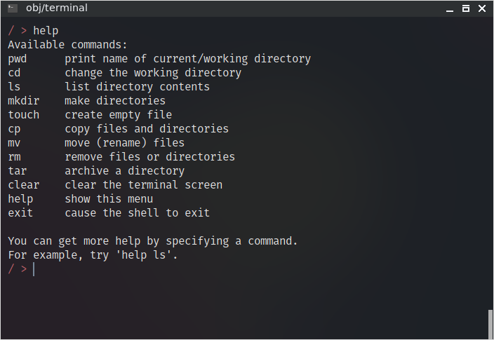

# Manuel utilisateur

Au cours de ce projet, plusieurs programmes principaux ont été développés, à savoir :

- un interpréteur de commandes
- un menu permettant le choix d'une commande parmi une liste
- des tests de paquetages

Il convient de détailler comment utiliser ces derniers.

Il est à noter que ces programmes ont tous été compilés depuis une machine Linux. Cela ne devrait pas poser de problème si ces mêmes programmes sont exécutés sur une autre machine Linux. Cependant, selon toute vraisemblance, ils ne fonctionneront pas depuis une machine Windows.

Pour les exécuter, il suffit de les lancer comme des programmes classiques. Par exemple, pour l'interpréteur de commande, et en supposant que nous sommes dans le répertoire de ce dernier :

```bash
./terminal
```

## Plan

[TOC]

## Interpréteur de commandes

L'interpréteur de commandes se présente comme un terminal classique :


Il est possible d'afficher un menu d'aide en saisissant la commande `help` :



Toutes les commandes affichées à l'écran sont utilisables, il est également possible d'obtenir de l'aide avancée sur une commande :


Voici un exemple de la création d'un dossier (`mkdir`) et de deux fichiers (`touch`) :


Il est possible d'afficher les dossiers et fichiers du répertoire courant à l'aide de la commande `ls` :


Ou récursivement à l'aide de `ls -r` :


Il est également possible d'ajouter un répertoire à afficher à la commande `ls` à l'aide d'un argument supplémentaire.

Vous pourrez facilement tester les autres commandes.

## Menu de commandes

Le menu affiche une liste des différents choix disponibles pour l'utilisateur :


La saisie se fait via un entier, et sera répétée tant que le nombre ne sera pas valide (ici, entre 0 et 10).


Via ce menu, il est possible de faire les mêmes choses que depuis l'interpréteur de commandes. Par exemple, créer un dossier et deux fichiers :


... Puis les afficher de façon récursive :


Bien que nous ayons développé ce menu tel qu'il l'était demandé, nous le trouvons (personnellement) beaucoup moins pratique que le terminal. Nous vous encourageons donc à l'utiliser un minimum.

## Tests de paquetages

Pour lancer un test, il suffit de l'exécuter via la ligne de commande puis d'observer les résultats. Chaque ligne finissant par `is incoherent` ou par `should have raised X_Error` montre une erreur ou l'absence de levée d'exception lorsqu'il devait y en avoir une. Voici un exemple du test du paquetage `P_Tree` :

